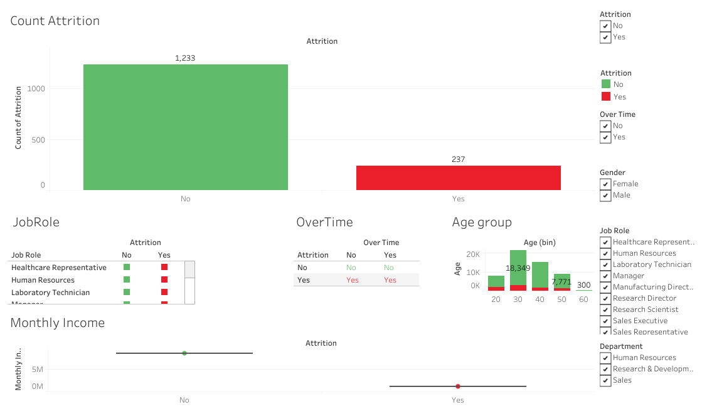

# 🧑‍💼 HR Employee Attrition Analysis
"End-to-end EDA &amp; Dashboard Project to identify employee attrition patterns using Python &amp; Tableau"

## 🔍 Objective
To explore and understand employee attrition patterns using Python for EDA and Tableau for interactive dashboards.

## 📁 Tools Used
- Python (Pandas, Matplotlib, Seaborn)
- Tableau Public (Dashboard)
- Jupyter Notebook
- GitHub

## 📊 Key Questions Explored
- What departments or job roles show higher attrition?
- Is Overtime related to employee exits?
- Does income or satisfaction affect retention?
- Which age groups are most likely to leave?

## 📈 Dashboard Preview
👉 [Click Here to View Full Tableau Dashboard](https://public.tableau.com/views/HRAnalytics_17538869170200/Whayareemplyeeleaving?:language=en-US&publish=yes&:sid=&:redirect=auth&:display_count=n&:origin=viz_share_link)

## 📑 Project Files
| File | Description |
|------|-------------|
| `HR_Attrition.ipynb` | Python EDA notebook |
| `HR_Attrition.csv` | Final cleaned dataset |

## 🤝 Let's Connect!
Feel free to connect or reach out on [LinkedIn](https://www.linkedin.com/in/jyotirmay-das-top/)  
